# Architecture Diagrams
## Hospitality Analytics Power BI Project

---

## 1. Overall Solution Architecture

### Explanation
This diagram shows the end-to-end solution from data sources through transformation, modeling, visualization, and consumption. It represents the complete technology stack and data pipeline.

### Mermaid Code
```mermaid
graph TB
    subgraph Sources["DATA SOURCES"]
        S1[("Hospitality_Data_Global_fct.csv<br/>100K rows")]
        S2[("Finance_dim.csv<br/>100K rows")]
        S3[("Feedback_dim.csv<br/>100K rows")]
        S4[("OnlineBooking_dim.csv<br/>100K rows")]
        S5[("Hotel_List_dim.xlsx<br/>7 rows")]
        S6[("Manager_Details_dim.xlsx<br/>7 rows")]
    end

    subgraph ETL["POWER QUERY ETL"]
        E1[Date Parsing<br/>DD-MM-YYYY → Date]
        E2[Encoding Fix<br/>Latin-1 → UTF-8]
        E3[PII Masking<br/>Email Obfuscation]
        E4[Calculated Columns<br/>NetProfit, GSS, IsPaid]
        E5[Date Table Generation<br/>2021-2025 Calendar]
    end

    subgraph Model["DATA MODEL (Star Schema)"]
        F[fct_Bookings<br/>100K rows]
        D1[dim_Date<br/>1,826 rows]
        D2[dim_Hotel<br/>7 rows]
        D3[dim_Manager<br/>7 rows]
        D4[dim_Finance<br/>100K rows]
        D5[dim_Feedback<br/>100K rows]
        D6[dim_OnlineBooking<br/>100K rows]
    end

    subgraph DAX["DAX ENGINE"]
        M1[51 Measures]
        M2[Time Intelligence]
        M3[KPI Calculations]
        M4[Conditional Logic]
    end

    subgraph Report["POWER BI REPORT"]
        R1[Home Page]
        R2[Executive Summary]
        R3[Revenue & Trends]
        R4[Hotel Manager View]
        R5[Channel Analysis]
        R6[Guest Satisfaction]
        R7[Member vs Non-Member]
        R8[Hotel Drillthrough]
        R9[Booking Detail]
    end

    subgraph Security["SECURITY LAYER"]
        RLS[Row-Level Security<br/>USERPRINCIPALNAME]
    end

    subgraph Service["POWER BI SERVICE"]
        WS[Workspace]
        DS[Dataset + Refresh]
        APP[Published App]
    end

    subgraph Users["CONSUMERS"]
        U1[Executives<br/>Full Access]
        U2[Hotel Managers<br/>RLS Filtered]
        U3[Analysts<br/>Full Access]
    end

    Sources --> ETL
    ETL --> Model
    Model --> DAX
    DAX --> Report
    Report --> Security
    Security --> Service
    Service --> Users
```

### PlantUML Code
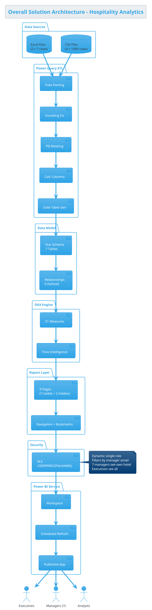

### ASCII Representation
```
┌─────────────────────────────────────────────────────────────────────────────┐
│                    HOSPITALITY ANALYTICS - SOLUTION ARCHITECTURE              │
├─────────────────────────────────────────────────────────────────────────────┤
│                                                                              │
│  ┌─────────────────────────────────────────────────────────────────┐        │
│  │ DATA SOURCES                                                     │        │
│  │  [CSV×4: 100K rows each]  [Excel×2: 7 rows each]               │        │
│  └──────────────────────────────┬──────────────────────────────────┘        │
│                                 │                                            │
│                                 ▼                                            │
│  ┌─────────────────────────────────────────────────────────────────┐        │
│  │ POWER QUERY ETL                                                  │        │
│  │  Date Parsing → Encoding Fix → PII Mask → Calc Cols → Date Gen  │        │
│  └──────────────────────────────┬──────────────────────────────────┘        │
│                                 │                                            │
│                                 ▼                                            │
│  ┌─────────────────────────────────────────────────────────────────┐        │
│  │ STAR SCHEMA DATA MODEL                                           │        │
│  │  1 Fact (fct_Bookings) + 6 Dimensions + 6 Relationships         │        │
│  └──────────────────────────────┬──────────────────────────────────┘        │
│                                 │                                            │
│                                 ▼                                            │
│  ┌─────────────────────────────────────────────────────────────────┐        │
│  │ DAX ENGINE: 51 Measures                                          │        │
│  │  Revenue(11) + Booking(9) + GSS(6) + Time(9) + Compare(12) + 4  │        │
│  └──────────────────────────────┬──────────────────────────────────┘        │
│                                 │                                            │
│                                 ▼                                            │
│  ┌─────────────────────────────────────────────────────────────────┐        │
│  │ REPORT LAYER: 9 Pages                                            │        │
│  │  [Home][Exec][Revenue][Manager][Channel][Satisfaction][Member]   │        │
│  │  [Hotel Drillthrough (hidden)][Booking Detail (hidden)]          │        │
│  └──────────────────────────────┬──────────────────────────────────┘        │
│                                 │                                            │
│                                 ▼                                            │
│  ┌─────────────────────────────────────────────────────────────────┐        │
│  │ ROW-LEVEL SECURITY                                               │        │
│  │  Role: HotelManager | Filter: ManagerEmail = USERPRINCIPALNAME() │        │
│  └──────────────────────────────┬──────────────────────────────────┘        │
│                                 │                                            │
│                                 ▼                                            │
│  ┌─────────────────────────────────────────────────────────────────┐        │
│  │ POWER BI SERVICE                                                 │        │
│  │  Workspace → Dataset (Daily Refresh 6AM) → Published App         │        │
│  └──────────────┬───────────────────────────────────┬──────────────┘        │
│                 │                                   │                        │
│                 ▼                                   ▼                        │
│         ┌──────────────┐                  ┌──────────────────┐              │
│         │ EXECUTIVES   │                  │ HOTEL MANAGERS    │              │
│         │ Full Access  │                  │ RLS Filtered      │              │
│         │ All 7 Hotels │                  │ 1 Hotel Each      │              │
│         └──────────────┘                  └──────────────────┘              │
│                                                                              │
└─────────────────────────────────────────────────────────────────────────────┘
```

---

## 2. Star Schema Diagram

### Explanation
The data model follows a star schema with fct_Bookings as the central fact table connected to 6 dimension tables. Three dimensions (Finance, Feedback, OnlineBooking) are fact extensions at the same grain (1:1 on BookingID).

### Mermaid Code
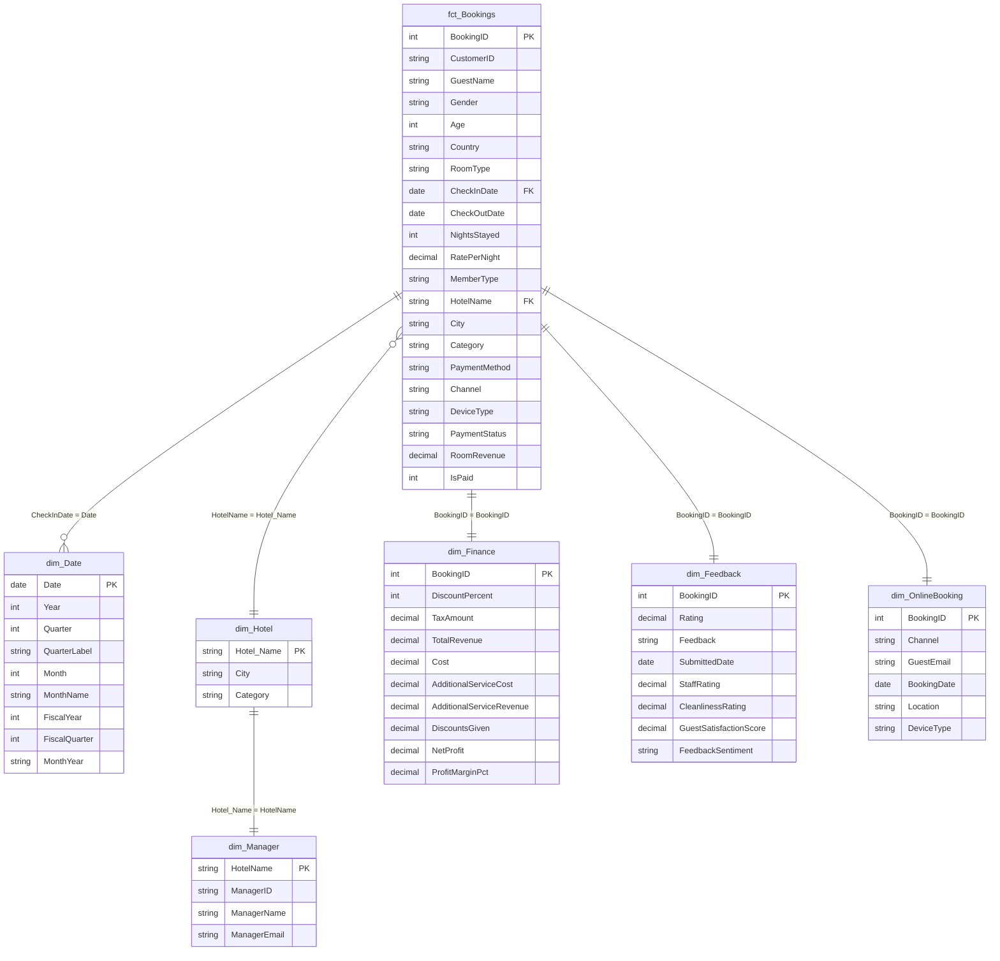

### ASCII Representation
```
                         ┌─────────────────────┐
                         │     dim_Date         │
                         │─────────────────────│
                         │ PK Date             │
                         │    Year, Quarter    │
                         │    Month, MonthYear │
                         │    FiscalYear       │
                         │    1,826 rows       │
                         └──────────┬──────────┘
                                    │ Many:1
                                    │ Single →
                                    │
┌──────────────────┐               │               ┌──────────────────┐
│   dim_Hotel      │               │               │   dim_Manager    │
│──────────────────│               │               │──────────────────│
│PK Hotel_Name     │◄──── 1:1 BOTH ┼──────────────►│PK HotelName     │
│   City           │               │               │   ManagerID      │
│   Category       │               │               │   ManagerName    │
│   7 rows         │               │               │   ManagerEmail   │
└────────┬─────────┘               │               │   7 rows         │
         │ Many:1                  │               └──────────────────┘
         │ Single →                │
         │                         │
┌────────┴─────────────────────────┴──────────────────────────────────────┐
│                         fct_Bookings                                      │
│──────────────────────────────────────────────────────────────────────────│
│ PK BookingID    | FK HotelName → dim_Hotel                               │
│    CustomerID   | FK CheckInDate → dim_Date                              │
│    GuestName    |    PaymentMethod, Channel, DeviceType                   │
│    Gender, Age  |    PaymentStatus, MemberType                           │
│    Country      |    RoomRevenue (calc), IsPaid (calc)                   │
│    RoomType     |                                                        │
│    NightsStayed |    100,000 rows                                        │
│    RatePerNight |                                                        │
└───────┬──────────────────┬──────────────────────┬────────────────────────┘
        │ 1:1 BOTH         │ 1:1 BOTH             │ 1:1 BOTH
        ▼                  ▼                      ▼
┌───────────────┐  ┌────────────────┐  ┌─────────────────────┐
│ dim_Finance   │  │ dim_Feedback   │  │ dim_OnlineBooking   │
│───────────────│  │────────────────│  │─────────────────────│
│PK BookingID   │  │PK BookingID    │  │PK BookingID         │
│  TotalRevenue │  │  Rating        │  │  Channel            │
│  Cost         │  │  Feedback      │  │  BookingDate        │
│  TaxAmount    │  │  StaffRating   │  │  Location           │
│  DiscountsGvn │  │  Cleanliness   │  │  DeviceType         │
│  NetProfit    │  │  GSS (calc)    │  │  GuestEmail(masked) │
│  ProfitMrg%   │  │  Sentiment     │  │                     │
│  100K rows    │  │  100K rows     │  │  100K rows          │
└───────────────┘  └────────────────┘  └─────────────────────┘
```

---

## 3. Data Flow Diagram

### Explanation
Shows data movement from raw source files through transformation stages to the final Power BI report consumption.

### Mermaid Code
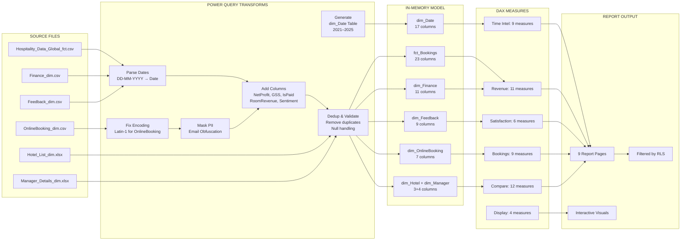

### ASCII Representation
```
SOURCE FILES          POWER QUERY           DATA MODEL          DAX              OUTPUT
─────────────         ───────────           ──────────          ───              ──────

┌──────────┐    ┌──────────────────┐    ┌──────────────┐   ┌──────────┐   ┌───────────┐
│Fact CSV  │───►│ Parse Dates      │───►│ fct_Bookings │──►│Revenue   │──►│ 9 Report  │
│(100K)    │    │ DD-MM-YYYY→Date  │    │ (23 cols)    │   │Measures  │   │ Pages     │
└──────────┘    └──────────────────┘    └──────────────┘   │(11)      │   │           │
                                                            └──────────┘   │ Filtered  │
┌──────────┐    ┌──────────────────┐    ┌──────────────┐   ┌──────────┐   │ by RLS    │
│Finance   │───►│ Null→0           │───►│ dim_Finance  │──►│Booking   │   │           │
│CSV(100K) │    │ Add NetProfit    │    │ (11 cols)    │   │Measures  │   │ Published │
└──────────┘    └──────────────────┘    └──────────────┘   │(9)       │   │ as App    │
                                                            └──────────┘   │           │
┌──────────┐    ┌──────────────────┐    ┌──────────────┐   ┌──────────┐   │ Daily     │
│Feedback  │───►│ Add GSS + Sent.  │───►│ dim_Feedback │──►│Satisf.   │   │ Refresh   │
│CSV(100K) │    │                  │    │ (9 cols)     │   │Measures  │   │ 6AM IST   │
└──────────┘    └──────────────────┘    └──────────────┘   │(6)       │   └───────────┘
                                                            └──────────┘
┌──────────┐    ┌──────────────────┐    ┌──────────────┐   ┌──────────┐
│Online    │───►│ Latin-1 Encoding │───►│dim_OnlineBkg │──►│Time Intl │
│CSV(100K) │    │ Mask Email       │    │ (7 cols)     │   │Measures  │
└──────────┘    └──────────────────┘    └──────────────┘   │(9)       │
                                                            └──────────┘
┌──────────┐    ┌──────────────────┐    ┌──────────────┐   ┌──────────┐
│Hotel.xlsx│───►│ Trim + Type      │───►│ dim_Hotel    │──►│Compare   │
│(7 rows)  │    │                  │    │ (3 cols)     │   │Measures  │
└──────────┘    └──────────────────┘    └──────────────┘   │(12)      │
                                                            └──────────┘
┌──────────┐    ┌──────────────────┐    ┌──────────────┐
│Manager   │───►│ Lowercase Email  │───►│ dim_Manager  │
│.xlsx(7)  │    │ Trim             │    │ (4 cols)     │
└──────────┘    └──────────────────┘    └──────────────┘

                ┌──────────────────┐    ┌──────────────┐
                │ GENERATE         │───►│ dim_Date     │
                │ Calendar 2021-25 │    │ (17 cols)    │
                └──────────────────┘    └──────────────┘
```

---

## 4. ETL Architecture

### Mermaid Code
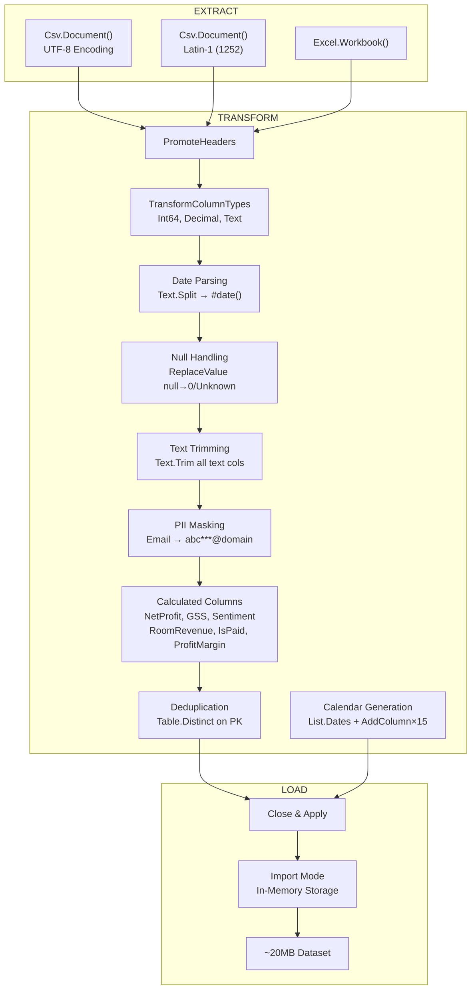

---

## 5. Row-Level Security Architecture

### Explanation
Shows how the single dynamic RLS role propagates through the data model to restrict access per hotel manager.

### Mermaid Code
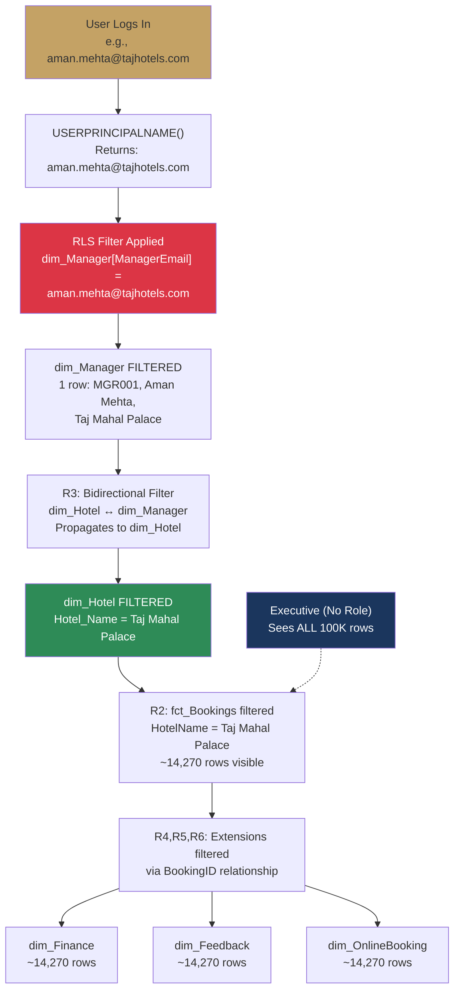

### ASCII Representation
```
┌──────────────────────────────────────────────────────────────────┐
│                    RLS FILTER PROPAGATION                          │
├──────────────────────────────────────────────────────────────────┤
│                                                                    │
│  USER LOGIN: aman.mehta@tajhotels.com                             │
│       │                                                            │
│       ▼                                                            │
│  ┌────────────────────────────────────────────┐                   │
│  │ USERPRINCIPALNAME() = aman.mehta@tajhotels │                   │
│  └────────────────────┬───────────────────────┘                   │
│                       │                                            │
│                       ▼                                            │
│  ┌────────────────────────────────────────────┐                   │
│  │ dim_Manager FILTERED → 1 row (MGR001)      │                   │
│  │ Aman Mehta | Taj Mahal Palace              │                   │
│  └────────────────────┬───────────────────────┘                   │
│                       │ R3 (Bidirectional)                         │
│                       ▼                                            │
│  ┌────────────────────────────────────────────┐                   │
│  │ dim_Hotel FILTERED → 1 row                 │                   │
│  │ Taj Mahal Palace | Mumbai | Luxury          │                   │
│  └────────────────────┬───────────────────────┘                   │
│                       │ R2 (Many:1 propagation)                    │
│                       ▼                                            │
│  ┌────────────────────────────────────────────┐                   │
│  │ fct_Bookings FILTERED → ~14,270 rows       │                   │
│  │ (Only Taj Mahal Palace bookings)            │                   │
│  └────┬───────────────┬───────────────┬───────┘                   │
│       │ R4            │ R5            │ R6                         │
│       ▼               ▼               ▼                            │
│  ┌──────────┐   ┌──────────┐   ┌──────────────┐                  │
│  │dim_Finance│   │dim_Feedbk│   │dim_OnlineBkg │                  │
│  │~14,270   │   │~14,270   │   │~14,270       │                  │
│  └──────────┘   └──────────┘   └──────────────┘                  │
│                                                                    │
│  ─ ─ ─ ─ ─ ─ ─ ─ ─ ─ ─ ─ ─ ─ ─ ─ ─ ─ ─ ─ ─ ─ ─ ─ ─ ─ ─ ─   │
│  EXECUTIVE (No role assigned) → Sees ALL 100,000 rows             │
│                                                                    │
└──────────────────────────────────────────────────────────────────┘
```

---

## 6. Dashboard Navigation Architecture

### Mermaid Code
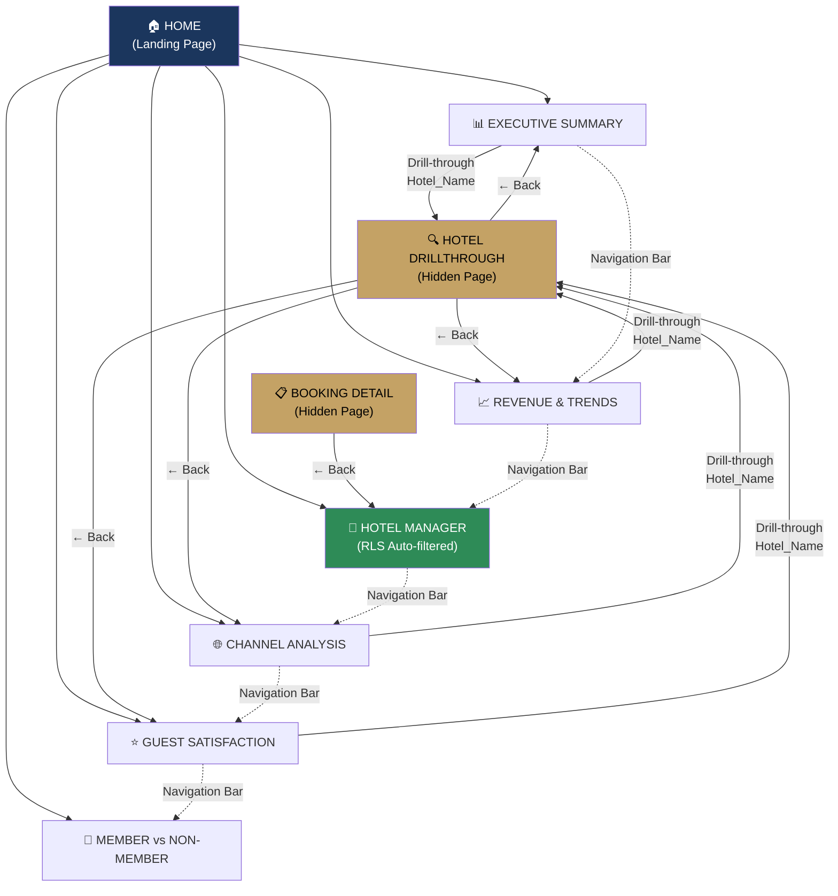

### ASCII Representation
```
                    ┌─────────────────────┐
                    │     🏠 HOME          │
                    │   (Landing Page)     │
                    └──────────┬──────────┘
                               │
          ┌────────────────────┼────────────────────┐
          │                    │                    │
          ▼                    ▼                    ▼
┌──────────────┐    ┌──────────────┐    ┌──────────────┐
│📊 Executive  │    │📈 Revenue &  │    │🏨 Hotel      │
│   Summary    │    │   Trends     │    │   Manager    │
│              │    │              │    │  (RLS Auto)  │
└──────┬───────┘    └──────┬───────┘    └──────────────┘
       │                   │
       │ drill             │ drill         ┌──────────────┐
       │                   │               │🌐 Channel    │
       ▼                   ▼               │   Analysis   │
┌──────────────────────────────────┐       └──────┬───────┘
│ 🔍 HOTEL DRILLTHROUGH (Hidden)   │              │ drill
│ Full hotel detail view           │◄─────────────┘
│ [← Back returns to source]       │
└──────────────────────────────────┘       ┌──────────────┐
                                           │⭐ Guest      │
                                           │  Satisfaction│
       ┌───────────────────────────┐       └──────┬───────┘
       │ 📋 BOOKING DETAIL (Hidden)│              │ drill
       │ Single booking view       │◄─────────────┘
       │ [← Back]                  │
       └───────────────────────────┘       ┌──────────────┐
                                           │👥 Member vs  │
    ════════════════════════════════        │  Non-Member  │
    NAVIGATION BAR on every page           └──────────────┘
    connects all 7 visible pages
    ════════════════════════════════
```

---

## 7. AI-DLC Lifecycle Architecture

### Explanation
The AI-Driven Development Lifecycle methodology used for this project, showing all 5 phases with their deliverables and gate approvals.

### Mermaid Code
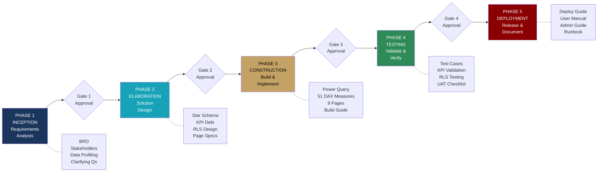

### ASCII Representation
```
┌─────────┐    ┌─────────┐    ┌─────────┐    ┌─────────┐    ┌─────────┐
│ PHASE 1 │───►│ PHASE 2 │───►│ PHASE 3 │───►│ PHASE 4 │───►│ PHASE 5 │
│INCEPTION│ ✓  │ELABORA- │ ✓  │CONSTRUC-│ ✓  │ TESTING │ ✓  │DEPLOY-  │
│         │    │TION     │    │TION     │    │         │    │MENT     │
└────┬────┘    └────┬────┘    └────┬────┘    └────┬────┘    └────┬────┘
     │              │              │              │              │
     ▼              ▼              ▼              ▼              ▼
┌─────────┐  ┌──────────┐  ┌──────────┐  ┌──────────┐  ┌──────────┐
│• BRD    │  │• Schema  │  │• PQ Code │  │• 35 Test │  │• Deploy  │
│• Stakeh.│  │• 40 KPIs │  │• 51 DAX  │  │  Cases   │  │  Guide   │
│• Data   │  │• RLS     │  │• 9 Pages │  │• RLS     │  │• User    │
│  Profile│  │  Design  │  │• Build   │  │  Matrix  │  │  Manual  │
│• Assump.│  │• Slicer  │  │  Guide   │  │• UAT     │  │• Admin   │
│• Risks  │  │  Strategy│  │• Theme   │  │  27 items│  │  Guide   │
│• Qs     │  │• Nav     │  │          │  │• Perf.   │  │• Runbook │
└─────────┘  └──────────┘  └──────────┘  └──────────┘  └──────────┘

Gate:  ✓ Approved    ✓ Approved    ✓ Approved    ✓ Approved    COMPLETE
```

---

## 8. Power BI Service Deployment Architecture

### Mermaid Code
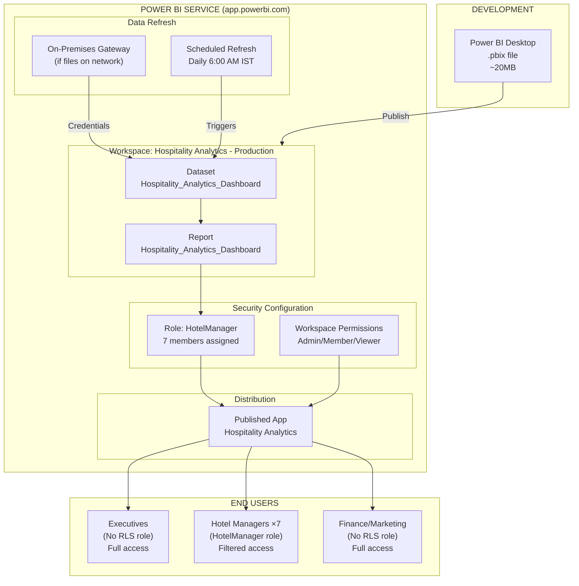

### ASCII Representation
```
┌───────────────────┐         ┌─────────────────────────────────────────────┐
│ POWER BI DESKTOP  │ Publish │        POWER BI SERVICE                      │
│                   │────────►│                                              │
│ .pbix (~20MB)     │         │  ┌─────────────────────────────────────┐    │
│ Development &     │         │  │ WORKSPACE: Hospitality Analytics    │    │
│ Testing           │         │  │                                     │    │
└───────────────────┘         │  │  ┌──────────┐    ┌──────────────┐  │    │
                              │  │  │ DATASET  │◄───│ GATEWAY      │  │    │
┌───────────────────┐         │  │  │          │    │ (if on-prem) │  │    │
│ SOURCE FILES      │         │  │  └────┬─────┘    └──────────────┘  │    │
│ CSV/Excel         │─ ─ ─ ─ ─│─ │─ ─ ─ ─│─ ─ ─ ─ ─ ─ ─ ─ ─ ─ ─ ─ │    │
│ (Shared drive /   │         │  │       │ Scheduled Refresh         │    │
│  SharePoint)      │         │  │       │ Daily 6:00 AM IST         │    │
└───────────────────┘         │  │       ▼                           │    │
                              │  │  ┌──────────┐                     │    │
                              │  │  │ REPORT   │                     │    │
                              │  │  │ 9 pages  │                     │    │
                              │  │  └────┬─────┘                     │    │
                              │  │       │                           │    │
                              │  │       ▼                           │    │
                              │  │  ┌──────────────────┐             │    │
                              │  │  │ RLS SECURITY     │             │    │
                              │  │  │ Role: HotelMgr   │             │    │
                              │  │  │ 7 members        │             │    │
                              │  │  └────┬─────────────┘             │    │
                              │  └───────┼─────────────────────────────┘    │
                              │          │                                   │
                              │          ▼                                   │
                              │  ┌──────────────────┐                       │
                              │  │ PUBLISHED APP    │                       │
                              │  │ "Hospitality     │                       │
                              │  │  Analytics"      │                       │
                              │  └────┬────────┬────┘                       │
                              └───────┼────────┼────────────────────────────┘
                                      │        │
                              ┌───────┘        └───────┐
                              ▼                        ▼
                     ┌──────────────┐        ┌──────────────────┐
                     │ EXECUTIVES   │        │ HOTEL MANAGERS    │
                     │ Full data    │        │ Own hotel only    │
                     │ (no role)    │        │ (RLS filtered)    │
                     └──────────────┘        └──────────────────┘
```

---

## 9. User Access Architecture

### Mermaid Code
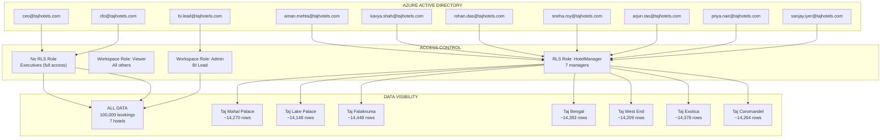

---

## 10. End-to-End System Architecture

### Explanation
Comprehensive view combining all architectural layers from infrastructure through data, application, and consumption tiers.

### Mermaid Code
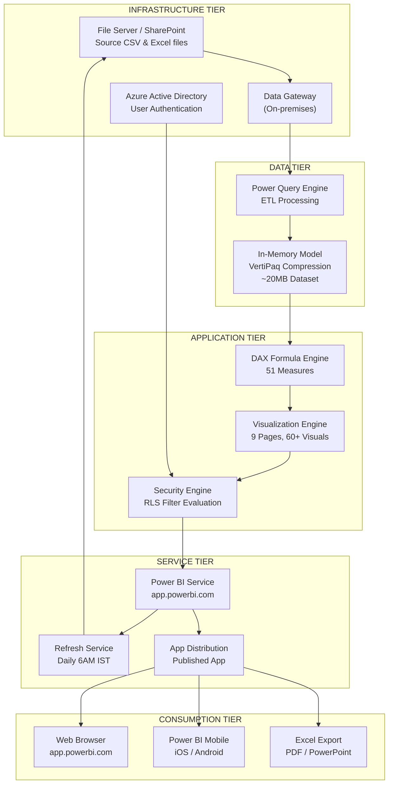

### ASCII Representation
```
╔══════════════════════════════════════════════════════════════════════════════╗
║                    END-TO-END SYSTEM ARCHITECTURE                           ║
╠══════════════════════════════════════════════════════════════════════════════╣
║                                                                             ║
║  ┌─────────────────────────────────────────────────────────────────────┐   ║
║  │ INFRASTRUCTURE TIER                                                  │   ║
║  │  [File Server/SharePoint] ──── [Data Gateway] ──── [Azure AD]       │   ║
║  └─────────────────────────────────┬───────────────────────────────────┘   ║
║                                    │                                        ║
║  ┌─────────────────────────────────▼───────────────────────────────────┐   ║
║  │ DATA TIER                                                            │   ║
║  │  [Power Query ETL] ──── [VertiPaq In-Memory Model ~20MB]            │   ║
║  │   7 queries, 64 steps      7 tables, 6 relationships                │   ║
║  └─────────────────────────────────┬───────────────────────────────────┘   ║
║                                    │                                        ║
║  ┌─────────────────────────────────▼───────────────────────────────────┐   ║
║  │ APPLICATION TIER                                                     │   ║
║  │  [DAX Engine] ─── [Visualization Engine] ─── [RLS Security Engine]  │   ║
║  │   51 measures       9 pages, 60+ visuals      1 role, 7 members     │   ║
║  └─────────────────────────────────┬───────────────────────────────────┘   ║
║                                    │                                        ║
║  ┌─────────────────────────────────▼───────────────────────────────────┐   ║
║  │ SERVICE TIER (Power BI Service)                                      │   ║
║  │  [Workspace] ─── [Scheduled Refresh] ─── [Published App]            │   ║
║  │   Pro License      Daily 6AM IST          Hospitality Analytics     │   ║
║  └─────────────────────────────────┬───────────────────────────────────┘   ║
║                                    │                                        ║
║  ┌─────────────────────────────────▼───────────────────────────────────┐   ║
║  │ CONSUMPTION TIER                                                     │   ║
║  │                                                                      │   ║
║  │  ┌────────────┐   ┌─────────────┐   ┌────────────┐                 │   ║
║  │  │ Web Browser│   │ Mobile App  │   │ Export     │                 │   ║
║  │  │ (Desktop)  │   │ (iOS/And)   │   │ (Excel/PDF)│                 │   ║
║  │  └──────┬─────┘   └──────┬──────┘   └──────┬─────┘                 │   ║
║  │         │                │                 │                         │   ║
║  │         ▼                ▼                 ▼                         │   ║
║  │  ┌────────────────────────────────────────────────────┐             │   ║
║  │  │ Executives (Full) │ Managers (RLS) │ Teams (Full)  │             │   ║
║  │  │    3 users         │    7 users      │   5+ users   │             │   ║
║  │  └────────────────────────────────────────────────────┘             │   ║
║  └──────────────────────────────────────────────────────────────────────┘   ║
║                                                                             ║
╚══════════════════════════════════════════════════════════════════════════════╝

METRICS:
  Data Volume: 100,000 bookings | 7 tables | 500K+ data points
  Performance: <5 sec page load | <60 sec refresh | ~20MB model
  Security: 1 dynamic RLS role | 7 filtered users | Executives unfiltered
  Availability: Daily refresh 6AM IST | 99.9% SLA (Power BI Service)
```

---

## Summary of All Diagrams

| # | Diagram | Purpose | Format Provided |
|---|---------|---------|-----------------|
| 1 | Overall Solution Architecture | Full stack overview | Mermaid + PlantUML + ASCII |
| 2 | Star Schema | Data model relationships | Mermaid ER + ASCII |
| 3 | Data Flow | Source to consumption pipeline | Mermaid + ASCII |
| 4 | ETL Architecture | Power Query processing stages | Mermaid |
| 5 | RLS Architecture | Security filter propagation | Mermaid + ASCII |
| 6 | Dashboard Navigation | Page flow and drill-through | Mermaid + ASCII |
| 7 | AI-DLC Lifecycle | Methodology phases | Mermaid + ASCII |
| 8 | Deployment Architecture | Power BI Service components | Mermaid + ASCII |
| 9 | User Access | Authentication and authorization | Mermaid |
| 10 | End-to-End System | Complete 5-tier architecture | Mermaid + ASCII |

---

## Usage Notes

- **Mermaid diagrams** can be rendered in GitHub, Azure DevOps, Notion, or any Mermaid-compatible viewer
- **PlantUML diagrams** require a PlantUML renderer (VS Code extension, online at plantuml.com)
- **ASCII diagrams** are universally viewable in any text editor or documentation system
- All diagrams are suitable for client presentations, technical documentation, and architecture review boards

*End of Architecture Diagrams*
